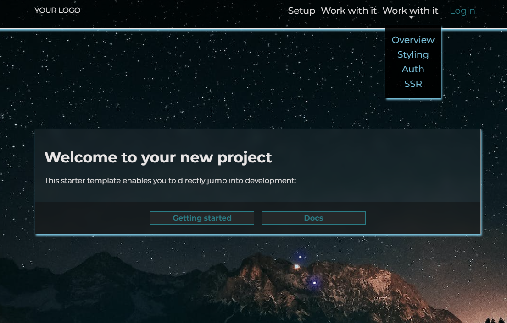

# neoan.io Lenkrad-core demo project

This project gives you an out-of-the-box experience for neoan.io lenkrad core.

## Installation

`composer create-project neoan.io/starter-project [my-app]`

`cd [my-app]`

`php start`

**You'll be up and running in less than a minute!**

## Requirements

- php 8.1+
- composer 2+

## Docs

The documentation for this project is served within the app. For the framework:

[Lenkrad: neoan.io/core](https://github.com/sroehrl/neoan.io-lenkrad-core#neoanio-lenkrad-core)

